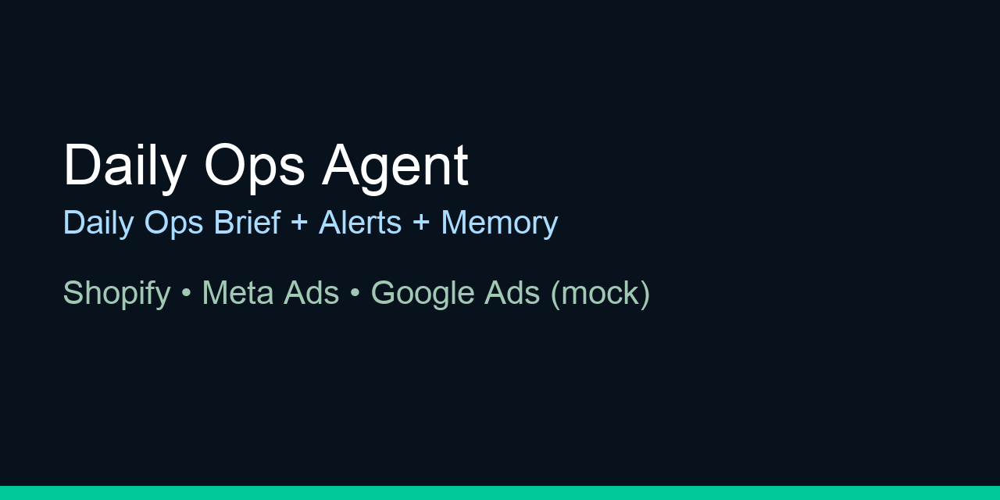
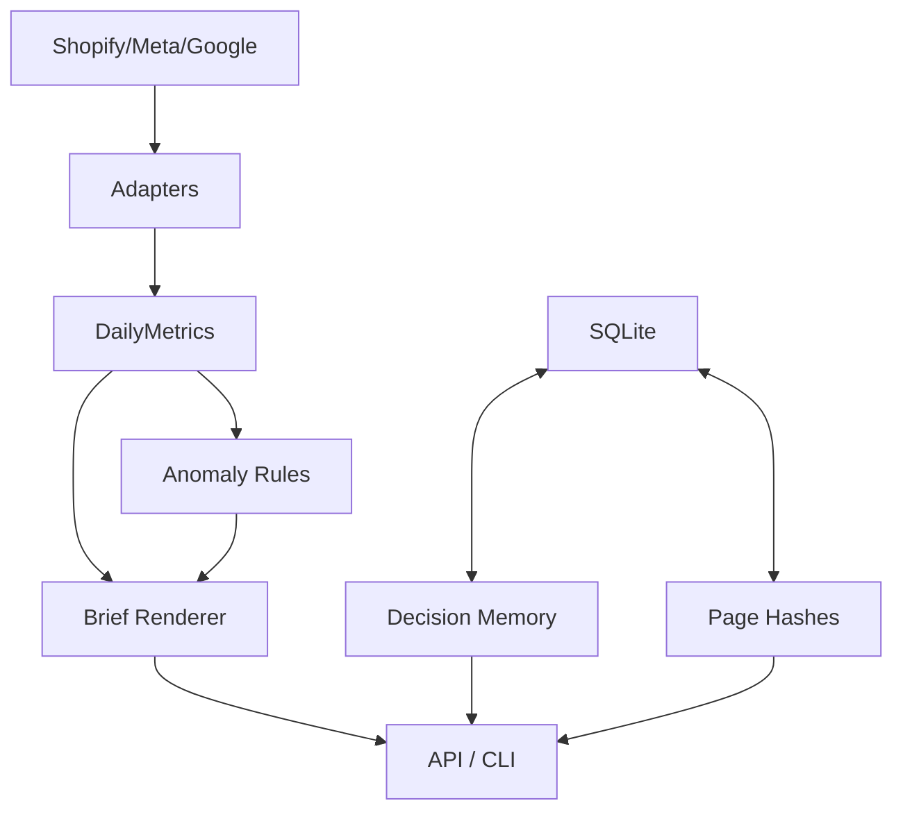

# Daily Ops Agent

Autonomous **Daily Ops Brief** generator for e-commerce: aggregates read-only metrics (Shopify + Meta Ads + Google Ads), detects performance anomalies, and maintains a lightweight decision memory.

**Built to apply my learnings** in agentic systems + production-style engineering, inspired by real client ops needs.




## What it does
- Ingests read-only metrics (mock adapters by default)
- Normalizes metrics into a single domain model (`DailyMetrics`)
- Generates alerts/anomaly signals (yesterday vs baseline)
- Produces a Markdown **Daily Ops Brief**
- Stores lightweight **decision memory** (SQLite)
- Snapshots landing page hashes for change detection (demo)

## Architecture (high level)


## Example output
See: `assets/sample-brief.md`

## What I learned building this
- Designing clean boundaries between **adapters**, **domain logic**, and **orchestration**
- Turning vague "numbers look bad" into deterministic **alerts + next checks**
- Keeping automation safe: **no secrets in repo**, mock-first demos, small testable units

## 60-second demo (local)

### 1) Requirements
- Python 3.11+

### 2) Install
```bash
python3 -m venv .venv
source .venv/bin/activate
pip install -r requirements.txt
```

### 3) Generate a brief (CLI)
```bash
python -m daily_ops_agent.cli.main brief
```

### 4) Run the API + open docs
```bash
uvicorn daily_ops_agent.api.main:app --reload
```

Open:
- Swagger UI: **http://127.0.0.1:8000/docs**
- Daily brief: **http://127.0.0.1:8000/brief/daily**

### 5) Snapshot demo landing pages
```bash
curl -X POST http://127.0.0.1:8000/changes/snapshot
curl "http://127.0.0.1:8000/changes?limit=20"
```

## Docker
```bash
docker compose up --build
```

## Docs
- `docs/architecture.md`
- `docs/runbook.md`
